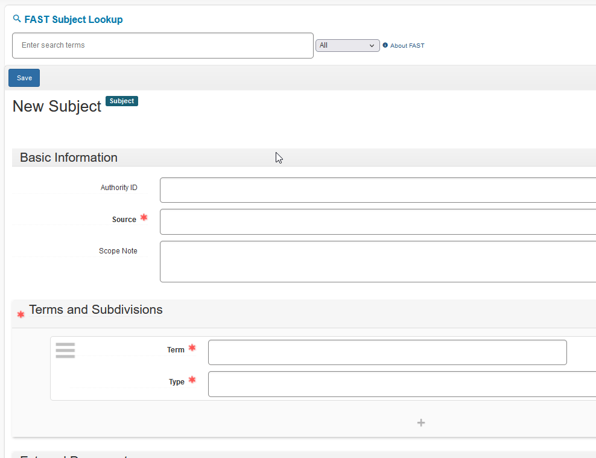

# Setup

## Install Plugin
1. Unzip the latest release into your archivesspace/plugins directory (this will create a new directory named "fast_subjects" inside the plugins directory). 
2. Add "fast_subjects" to the AppConfig[:plugins] property in config.rb.
    \#\# Plug-ins to load. They will load in the order specified
    AppConfig[:plugins] = ['local', 'lcnaf','fast_subjects']
3. Restart ArchivesSpace.

## Add FAST to Controlled Value List
Before using the plugin for the first time, FAST needs to be added as a valid subject source in your repository.

1. Select the **System** menu
2. Select **Manage Controlled Value Lists**
3. Under List Name, select **Subject Source**
4. Click **Create Value**
5. Enter the term **fast** in all lowercase. 
6. Verify that FAST has been added to the bottom of the Subject Source List. The translation should have been auto-populated with "FAST (Faceted Application of Subject Terminology)".

# Usage
1. The FAST Subject Lookup form will show up at the top of a blank Create Subject page.
1. Enter your search terms in any order, and the autocomplete function will search for similar FAST headings on the fly.
2. Clicking on a search result will insert its facets into the Terms and Subdivisions section of the current page (you may need to scroll to see it).
3. Be sure to SAVE your new subject record! 

# About
This plugin incorporates OCLC's FAST into the New Subject interface to allow users to dynamically look up and add FAST subject headings to ArchivesSpace. It is compatible with ArchivesSpace v3.5 (previous version compatability is likely but not guaranteed).

Faceted Application of Subject Terminology (FAST) is a subject heading schema developed by OCLC to simplify and streamline subject cataloging. It is derived from the Library of Congress Subject Headings (LCSH) and uses a faceted structure. [More information about FAST](https://www.oclc.org/research/areas/data-science/fast.html)

This plugin is released under MIT License and is not affiliated with OCLC. 

# Limitations

As of version 0.9, this plugin only works when creating subjects. Creation of agents will be added in a future release. 

